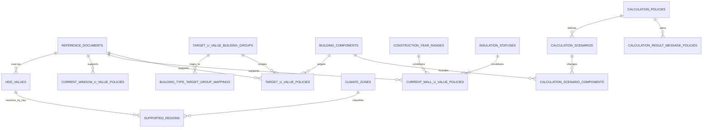

# GreenScan DB 설계 에이전트 지시문 v1

> **⚠️ v8.1 갱신 (2026-09-11, PM 확인 반영)**: PRD가 v8.1로 바뀌면서 "이 DB는 진단을 저장하지 않는다"는 이 문서의 핵심 전제가 **부분적으로 폐기**됐다. 로그인/계정 도입에 따라 사용자 계정과 진단 이력, 즐겨찾기는 이제 저장 대상이다(아래 9장 참고). 단, **사진 원본·AI 원본 응답·등급/레벨/견적 데이터는 여전히 저장하지 않는다** — 이 원칙은 유지된다. 이 문서의 0~8장(기준 데이터 스키마)은 변경 없이 그대로 유효하다.

## 0. 문서 목적과 최우선 규칙

이 문서는 `GreenScan PRD Agent Directive v7`을 기준으로 PostgreSQL의 **MVP 기준 데이터 DB**를 설계·구현·검토할 에이전트의 지시문이다. (v8.1부터는 9장의 계정/이력 스키마도 이 DB에 포함된다.)

이 문서에서 말하는 DB는 원래 사용자의 진단을 저장하는 DB가 아니었으나, v8.1부터는 로그인한 사용자의 진단 이력·즐겨찾기도 함께 저장한다. 0~8장은 여전히 계산에 필요한 정적 기준 데이터와 정책을 다루고, 9장이 계정/이력 영역을 별도로 다룬다.

에이전트는 다음 규칙을 반드시 지킨다.

1. PRD에 없는 사용자 기능, 저장 대상, 운영 기능을 새로 만들지 않는다.
2. 사진, 사용자 입력, AI 후보, 사용자 확정값, 계산 결과, 진단 이력을 PostgreSQL에 저장하지 않는다.
3. 기준 수치·연도 구간·지원 지역·시나리오 내용을 그럴듯하게 채워 넣지 않는다. 검증되지 않은 값은 시드하지 않고 `모호한 사항`으로 남긴다.
4. DB는 계산 엔진이 현재 U값, 개선 목표 U값, HDD, 계산 정책을 **버전과 출처를 가진 기준 데이터**로 조회할 수 있게 해야 한다.
5. `reference_data_missing` 상황에서는 임의의 대체값을 반환하지 않는다. 계산 엔진이 명시적으로 계산을 중단할 수 있어야 한다.
6. PRD의 현재 MVP 범위는 창호와 외기 접촉 벽체뿐이다. 천장, 바닥, 환기, 침기, 일사, 난방기기, 비용, 견적, 에너지 등급 데이터는 설계하지 않는다.
7. 이 문서의 논리 스키마와 제약을 바꾸려면 PRD 변경 또는 아래 `모호한 사항`의 정책 확정이 먼저 필요하다.

---

## 1. DB 범위

### 1.1 DB에 저장하는 대상

| 도메인 | DB 책임 |
|---|---|
| 지원 지역 | 표시명, 지원 여부, HDD 조회 키, 기후 조건 설명, 지역 정책 버전 |
| HDD | HDD 값, HDD 조회 키, 출처 문서와 버전 |
| 기준 출처 | 기준명, 고시번호, 기준 버전, 시행일, 출처 문서 |
| 현 상태 추정 U값 | 창호 유형·Low-E, 또는 준공연도 구간·기존 단열 상태에 따른 정책 U값과 정책 버전 |
| 개선 목표 U값 | 건물 기준 그룹, 기후구역 또는 지원 지역, 부위, 별표, 조건, U값, 출처 기준 버전 |
| 계산 정책 | 계산식 버전, 시나리오 정의, 결과 문구 정책 |

### 1.2 DB에 절대 만들지 않는 테이블

아래는 PRD에서 서버 또는 PostgreSQL 영구 저장 금지·제외 범위로 정했으므로 MVP DB에 넣지 않는다.

- ~~`users`, `accounts`, `profiles`, 로그인·권한·세션 테이블~~ → **(v8.1) 저장 대상으로 전환. 9장 참고.**
- ~~`diagnoses`, `diagnosis_results`, `calculation_results`, 진단 이력 테이블~~ → **(v8.1) 저장 대상으로 전환. 9장 참고.**
- `photos`, `image_metadata`, 업로드 파일·S3 키·사진 URL 테이블 — **(변경 없음, 계속 금지)**
- `ai_analysis`, `vision_responses`, AI 후보·confidence·프롬프트 이력 테이블 — **(변경 없음, 계속 금지)**
- `guest_sessions`, TTL·자동 삭제 작업용 테이블 — 로그인 세션 테이블은 9장에서 별도로 다룸(guest 세션과는 다른 개념)
- 고지서 원본·12개월 사용량·보정 이력 테이블 — **(변경 없음, 계속 금지)**
- LiDAR 스캔, RoomPlan, 포토그래메트리, 객체 추적 관련 테이블 — **(변경 없음, 계속 금지)**
- 견적·시공업체·비용·공식 인증·에너지 등급 테이블 — **(변경 없음, 계속 금지 — v8.1에서도 등급/레벨/견적은 제외)**

사진·AI 후보는 여전히 React의 임시 상태와 요청/응답 DTO 안에서만 다룬다. DB에는 남기지 않는다. **확정 입력·계산 결과는 v8.1부터 로그인 계정에 한해 9장 스키마로 저장한다.**

---

## 2. 논리 모델

### 2.1 기준 데이터 영역

1. `reference_documents`는 U값·HDD·정책의 출처 문서와 버전을 보존한다.
2. `climate_zones`, `supported_regions`, `hdd_values`는 사용자가 고른 지원 지역에서 검증된 HDD를 찾는 경로를 제공한다.
3. `current_window_u_value_policies`와 `current_wall_u_value_policies`는 현 상태 **추정** U값을 제공한다.
4. `target_u_value_policies`는 개선 시나리오에 적용할 목표 U값을 제공한다.
5. `calculation_policies`와 그 하위 테이블은 계산식 버전, 시나리오 정의, 결과 문구 정책을 보존한다.

### 2.2 계산 조회 흐름

계산 엔진은 DB에 진단을 저장하지 않고 아래 순서로 기준값만 조회한다.

1. 사용자 `building_type_key`를 `building_type_target_group_mappings`에서 개선 목표 U값 기준 그룹으로 변환한다.
2. 선택 `region_id`가 `supported_regions.is_supported = true`인지 확인하고, 해당 행의 `hdd_lookup_key`와 `climate_zone_key`를 얻는다.
3. `hdd_lookup_key`로 `hdd_values`를 조회한다.
4. 사용자 확정 `window_type_key + low_e_key`로 창호 현 상태 U값 정책을 조회한다.
5. 사용자 선택 `construction_year_range_key + insulation_status_key`로 벽체 현 상태 U값 정책을 조회한다.
6. 건물 기준 그룹·부위·기후구역 또는 지원 지역·기준 버전에 맞는 목표 U값을 조회한다.
7. 선택된 계산 정책의 시나리오 정의와 결과 문구 정책을 사용해 서버 계산 엔진이 결과를 만든다.

어느 단계에서든 조건에 맞는 검증된 행이 없으면 계산 엔진은 임의 수치를 만들지 않고 `reference_data_missing`으로 중단한다.

---

## 3. 테이블 상세 설계

### 3.1 `reference_documents`

기준값 또는 정책의 출처 문서를 보존한다. 예: 에너지절약설계기준 원문, HDD 출처, 현 상태 U값 정책의 근거 문서.

| 컬럼 | 타입 | 제약 | 의미 |
|---|---|---|---|
| `reference_document_id` | UUID | PK | 출처 문서 식별자 |
| `reference_name` | VARCHAR | NOT NULL | 기준명 또는 문서명 |
| `notice_number` | VARCHAR | NULL 허용 | 고시번호. 문서 성격상 없는 경우만 NULL |
| `reference_version` | VARCHAR | NOT NULL | 기준 또는 문서 버전 |
| `effective_date` | DATE | NULL 허용 | 시행일을 확인할 수 있는 경우 저장 |
| `source_document` | TEXT | NOT NULL | 출처 문서 위치 또는 식별 정보 |

- `reference_name + reference_version` 조합은 중복되지 않아야 한다.
- 출처 문서의 실제 내용·고시번호·시행일은 검증 후 시드한다. 이 문서가 값을 만들지 않는다.

### 3.2 `climate_zones`

개선 목표 U값과 지원 지역을 연결하는 기후구역 기준값이다.

| 컬럼 | 타입 | 제약 | 의미 |
|---|---|---|---|
| `climate_zone_key` | VARCHAR | PK | 기후구역 식별 키 |
| `display_name` | VARCHAR | NOT NULL | 화면 또는 결과 근거에 쓰는 기후구역명 |
| `description` | TEXT | NOT NULL | PRD의 기후 조건 설명 |

- 구역의 실제 명칭·코드·경계는 기준 원문 검증 전에는 시드하지 않는다.

### 3.3 `supported_regions`

MVP에서 선택 가능한 지역만 관리한다. 자유 시군구 입력을 위한 전국 지역 마스터가 아니다.

| 컬럼 | 타입 | 제약 | 의미 |
|---|---|---|---|
| `region_id` | VARCHAR | PK | 지원 지역 식별 키 |
| `display_name` | VARCHAR | NOT NULL | 사용자 표시명 |
| `is_supported` | BOOLEAN | NOT NULL | MVP 선택 가능 여부 |
| `hdd_lookup_key` | VARCHAR | NOT NULL, FK | HDD 조회 키 |
| `climate_zone_key` | VARCHAR | NOT NULL, FK | 적용 기후구역 |
| `region_data_version` | VARCHAR | NOT NULL | 지원 지역 정책 데이터 버전 |

- 계산 엔진은 `is_supported = true`인 행만 사용한다.
- `hdd_lookup_key`는 `hdd_values`에 존재해야 한다.
- 지역의 개수와 구체적인 목록은 이 스키마에서 확정하지 않는다.

### 3.4 `hdd_values`

지원 지역이 참조하는 HDD 값을 보존한다.

| 컬럼 | 타입 | 제약 | 의미 |
|---|---|---|---|
| `hdd_lookup_key` | VARCHAR | PK | 지역이 사용하는 HDD 조회 키 |
| `hdd_value_k_day` | NUMERIC | NOT NULL, 양수 | HDD 값. 단위 K·day |
| `reference_document_id` | UUID | NOT NULL, FK | HDD 출처 문서 |

- 하나의 HDD 키를 여러 지원 지역이 공유할 수 있다.
- 출처 문서의 버전은 `reference_documents`를 통해 보존한다.

### 3.5 `target_u_value_building_groups`

개선 목표 U값을 조회할 때 쓰는 건물 기준 그룹이다.

| 컬럼 | 타입 | 제약 | 의미 |
|---|---|---|---|
| `building_group_key` | VARCHAR | PK | 개선 목표 U값 기준 그룹 키 |
| `display_name` | VARCHAR | NOT NULL | 기준 그룹 표시명 |

이 테이블에는 PRD에 명시된 다음 두 의미의 그룹만 둔다.

- 단독·다가구주택에 대응하는 `공동주택 외`
- 아파트에 대응하는 `공동주택`

구체적인 영문·기계 코드 문자열은 아직 PRD가 정하지 않았으므로 시드 단계에서 팀 공통 DTO와 함께 확정한다.

### 3.6 `building_type_target_group_mappings`

사용자가 선택한 건물 유형을 개선 목표 U값 기준 그룹으로 변환한다.

| 컬럼 | 타입 | 제약 | 의미 |
|---|---|---|---|
| `building_type_key` | VARCHAR | PK | 사용자 건물 유형 식별 키 |
| `display_name` | VARCHAR | NOT NULL | 사용자 표시명 |
| `building_group_key` | VARCHAR | NOT NULL, FK | 목표 U값 기준 그룹 |

필수 매핑 의미는 아래와 같다.

| 사용자 선택 | 연결 그룹 |
|---|---|
| 단독·다가구주택 | 공동주택 외 |
| 아파트 | 공동주택 |

상가·공용부·세대 전체·건물 전체 유형은 행으로 만들지 않는다.

### 3.7 `building_components`

MVP 열손실·개선 목표 U값의 계산 부위를 제한한다.

| 컬럼 | 타입 | 제약 | 의미 |
|---|---|---|---|
| `component_key` | VARCHAR | PK | 부위 식별 키 |
| `display_name` | VARCHAR | NOT NULL | 부위 표시명 |

MVP 허용 부위는 창호와 외기 접촉 벽체뿐이다. 천장·바닥 등 제외 부위는 행으로 만들지 않는다.

### 3.8 `construction_year_ranges`

정확한 준공연도 대신 사용자가 선택하고 벽체 현 상태 U값 정책이 참조하는 정책화된 구간이다.

| 컬럼 | 타입 | 제약 | 의미 |
|---|---|---|---|
| `construction_year_range_key` | VARCHAR | PK | 준공연도 구간 식별 키 |
| `display_name` | VARCHAR | NOT NULL | 사용자 표시명 |
| `start_year` | SMALLINT | NULL 허용 | 구간 시작연도. 정책 확정 후 사용 |
| `end_year` | SMALLINT | NULL 허용 | 구간 종료연도. 정책 확정 후 사용 |

- 실제 구간 경계와 양끝 포함 규칙은 아직 확정하지 않는다.
- 사용자 입력은 정확한 연도가 아니라 이 테이블의 구간 키만 사용한다.

### 3.9 `insulation_statuses`

사용자가 직접 선택하는 기존 단열 상태의 정책 값을 관리한다. 사진 AI가 이 값을 확정하지 않는다.

| 컬럼 | 타입 | 제약 | 의미 |
|---|---|---|---|
| `insulation_status_key` | VARCHAR | PK | 기존 단열 상태 식별 키 |
| `display_name` | VARCHAR | NOT NULL | 사용자 표시명 |

- 허용 상태의 실제 enum과 라벨은 정책 확정 전에는 시드하지 않는다.

### 3.10 `current_window_u_value_policies`

사용자 확정 창호 유형과 Low-E 선택값으로 현 상태 **추정** U값을 찾는 정책 테이블이다.

| 컬럼 | 타입 | 제약 | 의미 |
|---|---|---|---|
| `current_window_u_policy_id` | UUID | PK | 정책 행 식별자 |
| `window_type_key` | VARCHAR | NOT NULL | 사용자 확정 창호 유형 |
| `low_e_key` | VARCHAR | NOT NULL | 사용자 확정 Low-E 선택값 또는 모름 |
| `u_value_w_m2k` | NUMERIC | NOT NULL, 양수 | 현 상태 추정 U값 |
| `policy_version` | VARCHAR | NOT NULL | 현 상태 창호 U값 정책 버전 |
| `reference_document_id` | UUID | NOT NULL, FK | 정책 근거 출처 문서 |

- `(window_type_key, low_e_key, policy_version)`은 유일해야 한다.
- Low-E `모름`도 사용자가 선택할 수 있으므로, 정책을 확정하면 대응 행이 반드시 필요하다.
- AI 후보·신뢰도는 이 테이블의 조회 조건이 아니다.

### 3.11 `current_wall_u_value_policies`

준공연도 구간과 기존 단열 상태로 현 상태 **추정** 벽체 U값을 찾는 정책 테이블이다.

| 컬럼 | 타입 | 제약 | 의미 |
|---|---|---|---|
| `current_wall_u_policy_id` | UUID | PK | 정책 행 식별자 |
| `construction_year_range_key` | VARCHAR | NOT NULL, FK | 준공연도 구간 |
| `insulation_status_key` | VARCHAR | NOT NULL, FK | 사용자가 확정한 기존 단열 상태 |
| `u_value_w_m2k` | NUMERIC | NOT NULL, 양수 | 현 상태 추정 U값 |
| `policy_version` | VARCHAR | NOT NULL | 현 상태 벽체 U값 정책 버전 |
| `reference_document_id` | UUID | NOT NULL, FK | 정책 근거 출처 문서 |

- `(construction_year_range_key, insulation_status_key, policy_version)`은 유일해야 한다.
- 벽체 사진의 이상 흔적 후보는 이 테이블의 조회 조건이 아니다.

### 3.12 `target_u_value_policies`

그린리모델링 개선 시나리오에 적용할 목표 U값 기준 행이다.

| 컬럼 | 타입 | 제약 | 의미 |
|---|---|---|---|
| `target_u_policy_id` | UUID | PK | 목표 U값 정책 행 식별자 |
| `building_group_key` | VARCHAR | NOT NULL, FK | 공동주택 외 또는 공동주택 기준 그룹 |
| `component_key` | VARCHAR | NOT NULL, FK | 창호 또는 외기 접촉 벽체 |
| `climate_zone_key` | VARCHAR | NULL 허용, FK | 기후구역 범위 기준일 때 사용 |
| `region_id` | VARCHAR | NULL 허용, FK | 지원 지역 범위 기준일 때 사용 |
| `appendix_identifier` | VARCHAR | NOT NULL | 실제 기준 원문에서 검증한 별표 식별자 |
| `condition_description` | TEXT | NOT NULL | U값 적용 조건 |
| `u_value_w_m2k` | NUMERIC | NOT NULL, 양수 | 개선 목표 U값 |
| `reference_document_id` | UUID | NOT NULL, FK | 기준 출처 문서 |

반드시 적용할 제약:

- `climate_zone_key`와 `region_id` 중 정확히 하나만 값이 있어야 한다.
- 창호와 외기 접촉 벽체의 별표 식별자는 실제 원문 검증 후 각 행에 저장한다. 두 부위를 같은 별표로 가정하지 않는다.
- 동일 건물 기준 그룹·부위·적용 범위·별표·조건·출처 기준 버전에 대해 목표 U값 행이 중복되면 안 된다.

### 3.13 `calculation_policies`

계산식 버전과 결과 문구 정책의 상위 단위다. 이 테이블은 진단 실행 이력이 아니다.

| 컬럼 | 타입 | 제약 | 의미 |
|---|---|---|---|
| `calculation_policy_id` | UUID | PK | 계산 정책 식별자 |
| `formula_version` | VARCHAR | NOT NULL, UNIQUE | 계산식 버전 |
| `result_message_policy_version` | VARCHAR | NOT NULL | 결과 문구 정책 버전 |

- PRD의 연간 열손실 식은 서버 코드가 수행한다. 이 테이블은 적용한 계산식 버전을 식별하기 위한 기준 데이터다.
- 계산식 외 대상(천장·바닥·환기 등)을 이 테이블이나 시나리오에 추가하지 않는다.

### 3.14 `calculation_scenarios`

계산 정책별 시나리오의 이름과 정의를 보존한다.

| 컬럼 | 타입 | 제약 | 의미 |
|---|---|---|---|
| `calculation_scenario_id` | UUID | PK | 시나리오 식별자 |
| `calculation_policy_id` | UUID | NOT NULL, FK | 적용 계산 정책 |
| `scenario_key` | VARCHAR | NOT NULL | 시나리오 식별 키 |
| `display_name` | VARCHAR | NOT NULL | 결과 화면 표시명 |

- `(calculation_policy_id, scenario_key)`는 유일해야 한다.
- 시나리오가 바꾸는 부위는 다음 조인 테이블로만 정의한다.
- PRD가 요구하는 2~3개 시나리오의 정확한 목록·이름·순서는 정책 확정 전까지 시드하지 않는다.

### 3.15 `calculation_scenario_components`

한 시나리오가 적용하는 개선 대상 부위를 연결한다. 복합 개선 시나리오를 표현하기 위해 필요하다.

| 컬럼 | 타입 | 제약 | 의미 |
|---|---|---|---|
| `calculation_scenario_id` | UUID | PK 일부, FK | 시나리오 |
| `component_key` | VARCHAR | PK 일부, FK | 개선 적용 부위 |

- 복합 PK는 `(calculation_scenario_id, component_key)`다.
- 허용 부위는 `building_components`의 창호·외기 접촉 벽체만이다.

### 3.16 `calculation_result_message_policies`

결과 화면의 결과 문구 정책을 계산식 버전과 함께 보존한다.

| 컬럼 | 타입 | 제약 | 의미 |
|---|---|---|---|
| `calculation_result_message_id` | UUID | PK | 결과 문구 행 식별자 |
| `calculation_policy_id` | UUID | NOT NULL, FK | 적용 계산 정책 |
| `message_key` | VARCHAR | NOT NULL | 문구 정책 식별 키 |
| `message_text` | TEXT | NOT NULL | 결과 화면에 표시할 문구 |

- `(calculation_policy_id, message_key)`는 유일해야 한다.
- 문구는 대표 공간 1개 기준의 비공식 추정치임을 유지하고, 건물 전체 에너지 사용량·공식 인증·위험도 등급을 주장해서는 안 된다.
- 정확한 문구 목록은 정책 확정 전에는 시드하지 않는다.

---

## 4. 관계와 무결성 규칙

### 4.1 핵심 관계



### 4.2 필수 제약

1. 모든 U값과 HDD 값은 양수여야 한다.
2. `supported_regions.hdd_lookup_key`는 존재하는 `hdd_values` 행을 참조해야 한다.
3. 지원 지역을 통한 목표 U값 조회는 해당 지역의 기후구역 또는 지역 자체 범위 중 하나만 사용한다.
4. 현재 창호 U값은 창호 유형·Low-E·정책 버전 조합으로 하나만 결정되어야 한다.
5. 현재 벽체 U값은 준공연도 구간·기존 단열 상태·정책 버전 조합으로 하나만 결정되어야 한다.
6. 목표 U값은 건물 기준 그룹·부위·적용 범위·별표·조건·출처 기준 버전 조합에서 하나만 결정되어야 한다. 조건이 여러 개인 경우 어떤 조건을 계산에 적용할지는 정책 확정 전까지 임의로 선택하지 않는다.
7. 시나리오의 우선순위는 DB에 고정 저장하지 않는다. PRD에 따라 계산 결과의 연간 감소량 내림차순으로 서버가 계산한다.
8. 사진상 이상 흔적은 DB 기준값 조회 조건과 계산식에 포함하지 않는다.

### 4.3 권장 인덱스

| 테이블 | 인덱스 또는 유일성 | 목적 |
|---|---|---|
| `reference_documents` | UNIQUE(`reference_name`, `reference_version`) | 출처 버전 중복 방지 |
| `supported_regions` | INDEX(`is_supported`) | 지원 지역 목록 조회 |
| `current_window_u_value_policies` | UNIQUE(`window_type_key`, `low_e_key`, `policy_version`) | 현 상태 창호 U값 단일 조회 |
| `current_wall_u_value_policies` | UNIQUE(`construction_year_range_key`, `insulation_status_key`, `policy_version`) | 현 상태 벽체 U값 단일 조회 |
| `target_u_value_policies` | 범위별 부분 UNIQUE 인덱스 | 기후구역 범위/지역 범위 목표 U값 중복 방지 |
| `calculation_scenarios` | UNIQUE(`calculation_policy_id`, `scenario_key`) | 시나리오 정의 중복 방지 |
| `calculation_scenario_components` | PK(`calculation_scenario_id`, `component_key`) | 복합 시나리오 부위 중복 방지 |
| `calculation_result_message_policies` | UNIQUE(`calculation_policy_id`, `message_key`) | 문구 정책 중복 방지 |

`target_u_value_policies`의 부분 UNIQUE 인덱스는 다음 두 경우를 별도로 강제한다.

- 기후구역 범위 행: 건물 기준 그룹·부위·기후구역·별표·조건·출처 문서 조합 유일
- 지원 지역 범위 행: 건물 기준 그룹·부위·지원 지역·별표·조건·출처 문서 조합 유일

---

## 5. DBML 초안

아래 DBML은 논리 모델과 FK를 공유하기 위한 초안이다. 실제 PostgreSQL 마이그레이션에서는 4.2의 CHECK 제약과 부분 UNIQUE 인덱스를 추가해야 한다.

```dbml
Table reference_documents {
  reference_document_id uuid [pk]
  reference_name varchar [not null]
  notice_number varchar
  reference_version varchar [not null]
  effective_date date
  source_document text [not null]

  Indexes {
    (reference_name, reference_version) [unique]
  }
}

Table climate_zones {
  climate_zone_key varchar [pk]
  display_name varchar [not null]
  description text [not null]
}

Table hdd_values {
  hdd_lookup_key varchar [pk]
  hdd_value_k_day numeric [not null]
  reference_document_id uuid [not null]
}

Table supported_regions {
  region_id varchar [pk]
  display_name varchar [not null]
  is_supported boolean [not null]
  hdd_lookup_key varchar [not null]
  climate_zone_key varchar [not null]
  region_data_version varchar [not null]
}

Table target_u_value_building_groups {
  building_group_key varchar [pk]
  display_name varchar [not null]
}

Table building_type_target_group_mappings {
  building_type_key varchar [pk]
  display_name varchar [not null]
  building_group_key varchar [not null]
}

Table building_components {
  component_key varchar [pk]
  display_name varchar [not null]
}

Table construction_year_ranges {
  construction_year_range_key varchar [pk]
  display_name varchar [not null]
  start_year smallint
  end_year smallint
}

Table insulation_statuses {
  insulation_status_key varchar [pk]
  display_name varchar [not null]
}

Table current_window_u_value_policies {
  current_window_u_policy_id uuid [pk]
  window_type_key varchar [not null]
  low_e_key varchar [not null]
  u_value_w_m2k numeric [not null]
  policy_version varchar [not null]
  reference_document_id uuid [not null]

  Indexes {
    (window_type_key, low_e_key, policy_version) [unique]
  }
}

Table current_wall_u_value_policies {
  current_wall_u_policy_id uuid [pk]
  construction_year_range_key varchar [not null]
  insulation_status_key varchar [not null]
  u_value_w_m2k numeric [not null]
  policy_version varchar [not null]
  reference_document_id uuid [not null]

  Indexes {
    (construction_year_range_key, insulation_status_key, policy_version) [unique]
  }
}

Table target_u_value_policies {
  target_u_policy_id uuid [pk]
  building_group_key varchar [not null]
  component_key varchar [not null]
  climate_zone_key varchar
  region_id varchar
  appendix_identifier varchar [not null]
  condition_description text [not null]
  u_value_w_m2k numeric [not null]
  reference_document_id uuid [not null]
}

Table calculation_policies {
  calculation_policy_id uuid [pk]
  formula_version varchar [not null, unique]
  result_message_policy_version varchar [not null]
}

Table calculation_scenarios {
  calculation_scenario_id uuid [pk]
  calculation_policy_id uuid [not null]
  scenario_key varchar [not null]
  display_name varchar [not null]

  Indexes {
    (calculation_policy_id, scenario_key) [unique]
  }
}

Table calculation_scenario_components {
  calculation_scenario_id uuid [not null]
  component_key varchar [not null]

  Indexes {
    (calculation_scenario_id, component_key) [pk]
  }
}

Table calculation_result_message_policies {
  calculation_result_message_id uuid [pk]
  calculation_policy_id uuid [not null]
  message_key varchar [not null]
  message_text text [not null]

  Indexes {
    (calculation_policy_id, message_key) [unique]
  }
}

Ref: hdd_values.reference_document_id > reference_documents.reference_document_id
Ref: supported_regions.hdd_lookup_key > hdd_values.hdd_lookup_key
Ref: supported_regions.climate_zone_key > climate_zones.climate_zone_key

Ref: building_type_target_group_mappings.building_group_key > target_u_value_building_groups.building_group_key

Ref: current_window_u_value_policies.reference_document_id > reference_documents.reference_document_id
Ref: current_wall_u_value_policies.construction_year_range_key > construction_year_ranges.construction_year_range_key
Ref: current_wall_u_value_policies.insulation_status_key > insulation_statuses.insulation_status_key
Ref: current_wall_u_value_policies.reference_document_id > reference_documents.reference_document_id

Ref: target_u_value_policies.building_group_key > target_u_value_building_groups.building_group_key
Ref: target_u_value_policies.component_key > building_components.component_key
Ref: target_u_value_policies.climate_zone_key > climate_zones.climate_zone_key
Ref: target_u_value_policies.region_id > supported_regions.region_id
Ref: target_u_value_policies.reference_document_id > reference_documents.reference_document_id

Ref: calculation_scenarios.calculation_policy_id > calculation_policies.calculation_policy_id
Ref: calculation_scenario_components.calculation_scenario_id > calculation_scenarios.calculation_scenario_id
Ref: calculation_scenario_components.component_key > building_components.component_key
Ref: calculation_result_message_policies.calculation_policy_id > calculation_policies.calculation_policy_id
```

---

## 6. 구현 지시

### 6.1 마이그레이션과 시드 순서

1. `reference_documents`, `climate_zones`, `target_u_value_building_groups`, `building_components`, `construction_year_ranges`, `insulation_statuses`를 먼저 만든다.
2. `hdd_values`, `supported_regions`, `building_type_target_group_mappings`을 만든다.
3. 현재 U값 정책과 개선 목표 U값 정책을 만든다.
4. 계산 정책·시나리오·결과 문구 정책을 만든다.
5. 실제 시드는 출처 원문·버전·단위 검증이 끝난 값만 넣는다.

### 6.2 계산 엔진 경계

- 계산식 `annual_heat_loss_kwh = u_value × area_m2 × 24 × hdd ÷ 1000`은 서버 코드에서 실행한다.
- DB는 U값, HDD, 시나리오 정의, 계산식 버전만 제공한다.
- 벽체 순면적 `외기 접촉 벽체 합산면적 - 창호 합산면적` 검증은 계산 요청을 받은 서버의 입력 검증 책임이다. 이 값이나 사용자 면적을 DB에 저장하지 않는다.
- 이상 흔적 안내는 사용자 확정값으로 결과 문구를 선택할 수 있으나, 이상 흔적 자체를 DB의 U값 정책 조건으로 넣지 않는다.

### 6.3 기준 데이터 누락 처리

다음 중 하나라도 조회되지 않으면 계산을 중단한다.

- 선택한 지원 지역 또는 HDD
- 창호 현 상태 U값 정책
- 벽체 현 상태 U값 정책
- 창호 또는 외기 접촉 벽체 개선 목표 U값 정책
- 계산 정책·시나리오 정의

이때 서버는 `reference_data_missing`을 반환하며, 누락한 조회 종류를 응답에 포함한다. 대체 U값·기본 HDD·기본 시나리오를 코드에 하드코딩하지 않는다.

### 6.4 에이전트 금지 사항

- 테이블에 `created_at`, `updated_at`, `deleted_at`, soft delete, audit log를 자동으로 추가하지 않는다.
- 진단을 저장하기 위한 FK를 기준 데이터 테이블에 추가하지 않는다.
- 이미지·AI 응답·사용자 선택 이력을 편의상 JSON 컬럼에 보관하지 않는다.
- 미확정 U값, 지역, 기후구역, 연도 구간, 시나리오를 예시 데이터라는 이유로 실제 시드에 넣지 않는다.
- 현재 U값과 개선 목표 U값을 하나의 테이블·하나의 값으로 합치지 않는다.

---

## 7. PRD 교차 검증

| PRD 요구 | 반영 설계 | 검증 결과 |
|---|---|---|
| PostgreSQL은 U값·HDD·지원 지역·기준 버전·출처 등 정적 기준 데이터용 | 전체 스키마 | 충족 |
| 로그인·진단 이력·사진 메타데이터·AI 분석 이력·계산 결과를 저장하지 않음 | 1.2의 명시적 제외, 진단 테이블 부재 | 충족 |
| 지원 지역은 표시명·지원 여부·HDD 조회 키·기후 조건 설명·데이터 버전을 보존 | `supported_regions`, `climate_zones` | 충족 |
| 선택 지원 지역 키로 HDD를 직접 조회하고, HDD 출처·버전을 보존 | `supported_regions.hdd_lookup_key` → `hdd_values` → `reference_documents` | 충족 |
| 현재 창호 U값은 사용자 확정 창호 유형과 Low-E로 조회 | `current_window_u_value_policies` | 충족 |
| 현재 벽체 U값은 준공연도 구간과 기존 단열 상태로 조회 | `current_wall_u_value_policies` | 충족 |
| 현재 U값과 개선 목표 U값은 분리 | 현재 U값 정책 테이블 2개와 `target_u_value_policies` 분리 | 충족 |
| 개선 목표 U값은 건물 기준 그룹·기후구역 또는 지원 지역·부위·기준 버전으로 조회 | 건물 그룹 매핑, 기후/지역 범위 CHECK, 부위 FK, 출처 문서 FK | 충족 |
| 단독·다가구는 공동주택 외, 아파트는 공동주택으로 매핑 | `building_type_target_group_mappings` | 충족 |
| 창호와 외벽의 별표를 같은 것으로 가정하지 않음 | 목표 U값 행별 `appendix_identifier`와 출처 문서 | 충족 |
| 계산 정책은 계산식 버전·시나리오 정의·결과 문구 정책을 보존 | `calculation_policies`, 시나리오·문구 하위 테이블 | 충족 |
| 시나리오는 창호·벽체·복합 개선을 표현할 수 있어야 함 | `calculation_scenarios` + 다대다 부위 조인 | 충족. 실제 목록은 미확정 |
| 우선순위는 연간 감소량 큰 순서 | DB 저장 컬럼을 두지 않고 서버 계산 책임으로 유지 | 충족 |
| 이상 흔적은 현장 점검 안내만 바꾸며 열손실 계산에 영향 없음 | 이상 흔적 관련 DB 컬럼·U값 조회 조건 없음 | 충족 |
| LiDAR는 후속 확장이며 MVP 처리·저장 없음 | LiDAR 테이블 부재 | 충족 |
| 기준값 누락 시 임의 수치 대신 오류 | 6.3 조회 규칙 | 충족 |

교차 검증 결론: 이 설계는 PRD가 명시한 정적 기준 데이터 책임만 모델링하며, PRD가 금지하거나 서버 임시 상태로 한 데이터를 영구 저장하지 않는다.

---

## 8. 모호한 사항 및 정책 확정 필요

아래 사항은 PRD에서 값 또는 선택 규칙이 확정되지 않았다. 에이전트와 구현자는 임의로 채우지 말고 PM·BE-C·기준 원문 검증 결과를 받아 시드와 API 옵션을 확정한다.

| 항목 | 왜 확정이 필요한가 | 영향 테이블 |
|---|---|---|
| 준공연도 구간의 실제 경계와 양끝 포함 규칙 | PRD는 정책화된 구간을 요구하지만 시작·종료 연도 규칙은 없음 | `construction_year_ranges`, `current_wall_u_value_policies` |
| 기존 단열 상태의 enum·사용자 라벨 | PRD는 입력과 조회 조건만 지정 | `insulation_statuses`, `current_wall_u_value_policies` |
| 현재 창호 U값의 실제 정책값과 Low-E `모름` 행 | PRD는 계산 조건만 지정 | `current_window_u_value_policies` |
| 현재 벽체 U값의 실제 정책값과 근거 | PRD는 준공연도 구간+단열 상태 조건만 지정 | `current_wall_u_value_policies` |
| 데모 지원 지역의 구체적 목록, 지역 키, 기후구역 | PRD는 소수 지역만 지원한다고 했고 목록은 정책 데이터로 남김 | `supported_regions`, `climate_zones` |
| HDD 값·출처 문서·버전 | 검증된 HDD만 사용해야 함 | `hdd_values`, `reference_documents` |
| 목표 U값이 기후구역 범위인지 지원 지역 범위인지 | PRD는 둘 중 하나를 허용하지만 데이터 적용 정책은 미정 | `target_u_value_policies` |
| 창호·외기 접촉 벽체별 실제 별표 식별자, 조건, U값, 고시번호·시행일 | PRD는 원문 확인을 요구하며 두 부위를 같은 별표로 가정하지 말라고 함 | `target_u_value_policies`, `reference_documents` |
| 같은 부위·기후 조건에서 기준 원문에 여러 적용 조건 행이 있을 때의 선택 규칙 | PRD는 조건 보존을 요구하지만 사용자 입력 또는 우선순위 규칙을 지정하지 않음 | `target_u_value_policies`, 계산 엔진 |
| 2024년 기준을 데모 비교 버전으로 고정할지 여부와 선택 기준 | 사용할 수 있다고만 했으며 최신 법정 기준 주장 금지 | 모든 기준 정책·출처 문서 |
| 여러 기준 버전이 존재할 때 MVP가 어떤 버전을 선택하는지 | 버전 보존은 요구하지만 활성·선택 정책은 명시되지 않음 | U값 정책, HDD, 계산 정책 |
| 실제 계산 시나리오 2~3개의 목록·이름·구성 | PRD는 창호·벽체·복합 개선 예시를 들지만 확정 목록은 없음 | `calculation_scenarios`, `calculation_scenario_components` |
| 결과 문구의 정확한 종류와 문구 내용 | PRD는 결과 문구 정책 보존을 요구하지만 문구 목록은 미정 | `calculation_result_message_policies` |
| `reference_data_missing` 응답의 상세 형식과 HTTP 상태 코드 | PRD는 오류 원칙만 정의 | API 명세, 계산 엔진 |

이 목록의 값이 확정되기 전에도 마이그레이션과 Mock 구조는 만들 수 있다. 단, 실제 U값·HDD가 필요한 계산 완료 시연은 해당 기준 데이터 시드가 검증되기 전에는 완료로 처리하면 안 된다.

---

## 9. (v8.1 신규) 계정·진단 이력·즐겨찾기

PRD v8.1(2026-09-11 PM 확인)에서 로그인/계정을 도입하면서 이 DB의 책임이 넓어졌다. 0~8장의 기준 데이터 원칙(임의 수치 금지, reference_data_missing 등)은 이 장에는 적용되지 않는다 — 여기는 순수 저장 스키마다. 단, **사진 원본·AI 원본 응답·등급/레벨/견적은 이 장에서도 저장하지 않는다.**

### 9.1 범위

| 도메인 | DB 책임 |
|---|---|
| 사용자 계정 | 로그인 ID, 비밀번호 해시 등 — **JWT 미사용.** 계정은 운영자가 미리 시드하며 자체 가입 플로우 없음 |
| 로그인 세션 | 비-JWT opaque 세션 토큰과 만료 시각 |
| 진단 이력 | 계정에 귀속된 확정 입력값 + 계산 결과 스냅샷 (원본 사진 제외) |
| 즐겨찾기 | 계정이 저장한 즐겨찾기 항목 (단순 토글, 그 이상 없음 — PRD 2.2절) |

### 9.2 테이블 초안

정확한 컬럼 제약(인덱스, 세션 TTL 등)은 BE-A가 구현 시 확정한다. 아래는 최소 골격이다.

```
Table users {
  user_id uuid [pk]
  login_id varchar [not null, unique]   // 자체 가입 없음 — 운영자가 시드
  password_hash varchar [not null]
  display_name varchar
  created_at timestamp [not null]
}

Table sessions {
  session_token varchar [pk]            // 비-JWT opaque 토큰
  user_id uuid [not null]
  expires_at timestamp [not null]
}

Table diagnoses {
  diagnosis_id uuid [pk]
  user_id uuid [not null]
  building_type_key varchar [not null]
  region_id varchar [not null]
  confirmed_input jsonb [not null]      // 사용자 확정 공간/창호/벽체 입력
  calculation_result jsonb [not null]   // 기준선·시나리오·우선순위 스냅샷
  calculation_version varchar [not null]
  reference_data_version varchar [not null]
  created_at timestamp [not null]
}

Table favorites {
  favorite_id uuid [pk]
  user_id uuid [not null]
  diagnosis_id uuid                     // 즐겨찾기 대상 모델 미확정 — 9.3 참고
  created_at timestamp [not null]
}

Ref: sessions.user_id > users.user_id
Ref: diagnoses.user_id > users.user_id
Ref: favorites.user_id > users.user_id
Ref: favorites.diagnosis_id > diagnoses.diagnosis_id
```

`diagnoses.confirmed_input`/`calculation_result`를 JSONB로 둔 것은 이 장이 기준 데이터 정규화 원칙(0~8장)을 따르지 않는 별도 저장 영역이기 때문이다 — 이력은 "그 시점에 보여준 결과의 스냅샷"이면 충분하고, 이후 기준 데이터가 바뀌어도 과거 이력이 달라지면 안 되므로 오히려 정규화하지 않고 스냅샷으로 굳히는 편이 맞다.

### 9.3 정책 확정 필요 (BE-A)

| 항목 | 비고 |
|---|---|
| 비밀번호 해시 알고리즘 | bcrypt/argon2 등 확정 필요 |
| 세션 토큰 만료 정책 (TTL) | 미확정 |
| `diagnoses` 저장 시점 | 계산 즉시 자동 저장 vs 사용자가 명시적으로 "저장" 눌러야 하는지 |
| `favorites`가 가리키는 대상 | 진단 결과 1건 단위인지, 주소/지역 단위인지 — 위 초안은 진단 결과 단위로 가정 |
| 계정 시드 방법 | 마이그레이션에 하드코딩할지, 별도 운영 스크립트로 둘지 |
